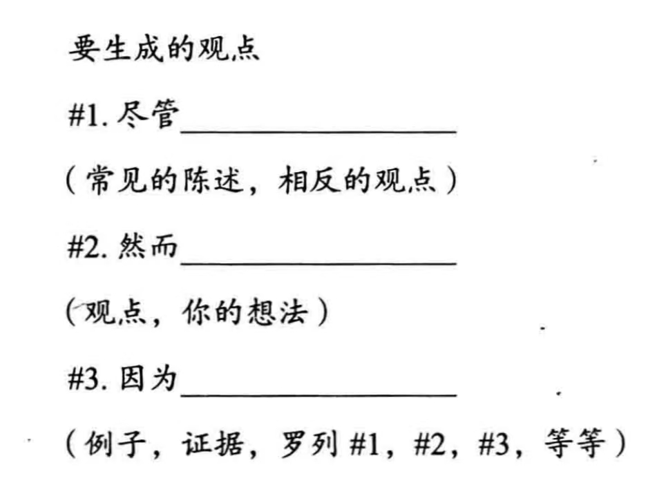

>文章被拒的主要原因：你的文章没有论点。
>编辑或审稿人会说：你的文章原创性不强、研究意义不大、组织混乱或缺乏严密的分析。
>解决方法就是：有一个论点，并且及时且清楚地表达出来，然后围绕论点展开论述。

# 论点
>从专业技术上讲，一个论点就是作者通过一系列连贯的表述引导读者从确定的前提出发，直至得出最终结论。
>一个论文至少由两个部分：观点陈述和论据。

# 写一篇由论点驱动的文章
>不要让你的文章围绕着数据进行组织，却没有围绕论点展开论述。

如果通过罗列所有数据，得出结论，——>那么这就是在写一篇报告。
如果通过证据去支持你的观点，思考那些不会支持该案例的证据，忽略那些既不支持也不反对你的观点的证据，——>这样才是一篇由论点驱动的文章。

>要构建合理的论点，就需要把反对派的声音考虑在内，这才是优秀学术论文作者的标志。

# 围绕论点组织文章
## 1 . 草拟你的论点
可以利用**观点即时生成器**：

或者可以**画**出你的文章：用箭头和圆圈来标注不同的理论、主题、文本之间的关系。
## 2. 列出论据
做一个简短地清单，不用很详细，列出能证明论点的内容即可。
## 3. 修改摘要
重新审阅你的摘要，他是否说明了你的论点？
[Note8-第二章-摘要](Note8-第二章-摘要.md)
如果没有，那么带着论点重写摘要。
## 4. 听听别人的意见
 通过邮件、面谈、书面、口头的方式找另外的三个人看，可以同一领域，也可以是不同领域的。
 问问他们能否找到明确的论点，听听别人的的评价。
## 5.重新审视文章
### 前言
我的前言是否围绕论点进行组织了？
### 正文
我是否围绕论点展开了全文？/我应该如何围绕论点展开全文？
认真地评估**每一个段落**与**论点**的相关度。
不要虚构牵强的关系，你必须让读者清楚地知道它们的内在联系。
### 论据
我所表述的论据是否与论点相关？
### 结论
我在结论中重新表述了我的论点吗？
**确定了问题后，围绕论点来修改文章。** 这是一件很花费时间的事情，如果有必要，可以在每周都安排时间修改文章。