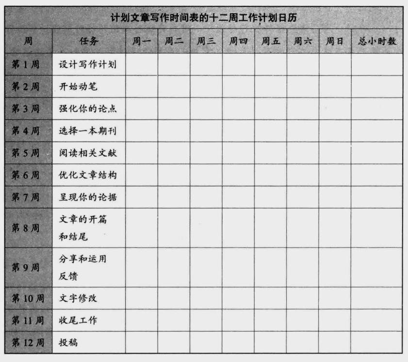

> [!hint] 观点
> 写作是每天都要完成的，不能为了等待一段长的或者不被打扰的时间而去写作。就像跑马拉松，如果除了在跑马拉松的那一天，其余时间都不跑步，这段经历一定会成为一段非常痛苦，不想重复的经历。

**想法：** 写作是要经常进行的，现在很多时候都是想直接憋一个质变，而忽略了量变的过程。

---
> [!hint] 观点
> 有规律地用适当的时长从事非情绪化写作的人写出的文章页数更多，享受到论文被录用的喜悦更多，沮丧更少，创造力更强。

**想法：** 这里说的意思就像是某时听到了某人的成果，而发奋，用自己的情绪去写作，等到热情没了，写作就又停止了。

---
> [!hint] 观点
> 最好是要一周的每天都抽出 15 分钟去写，这样能保证每天的思想都在不断的更新，在有大段空闲时间时，再写作，效率比较高。

**想法：** 深有感触，有些事情花了大把时间学会，然后突然就废止了，某天再捡起来，还需要花很多时间去重新了解怎么使用。就像前段时间想要重新搭建网站，结果收拾了半天，一点窍门也没找到，连续花了五个多小时才把以前的网站的流程用明白。

### 计划文章写作时间表
