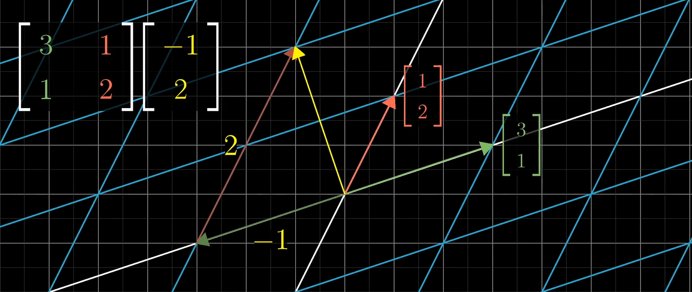
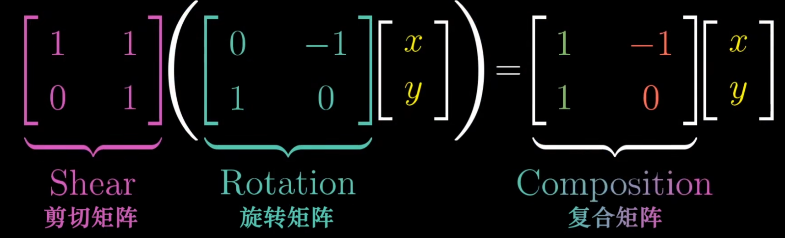
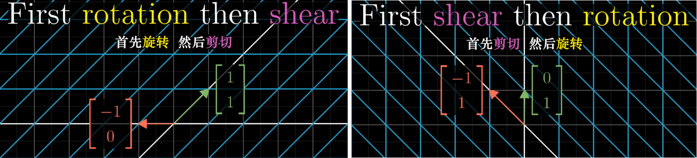
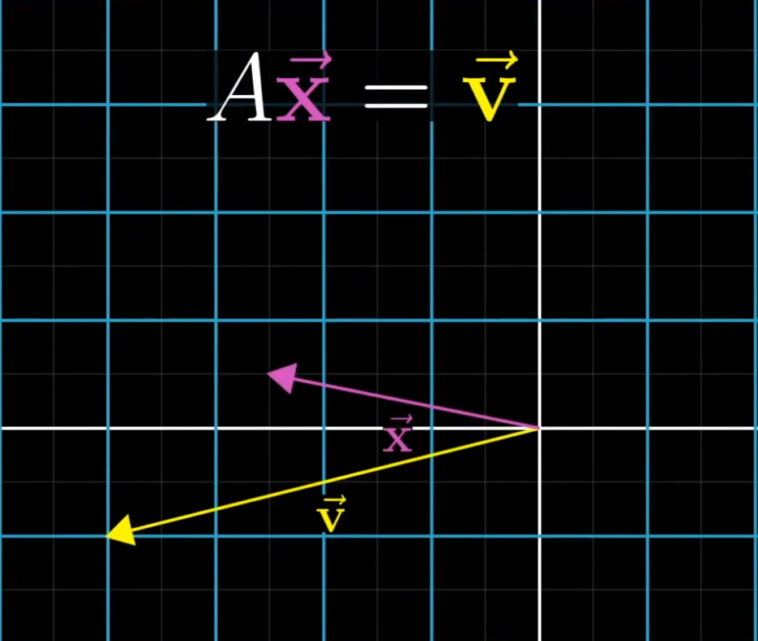
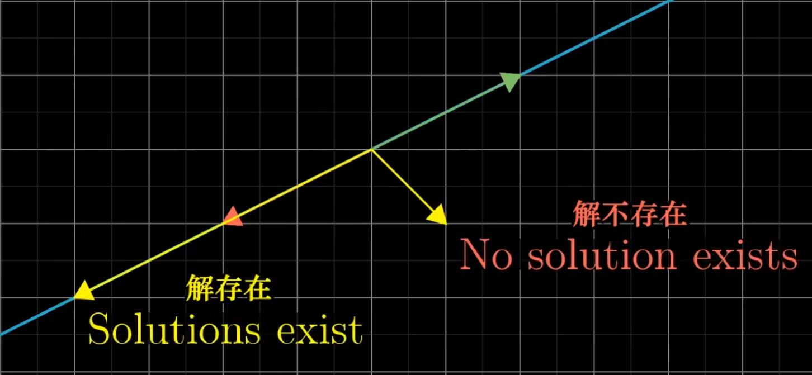
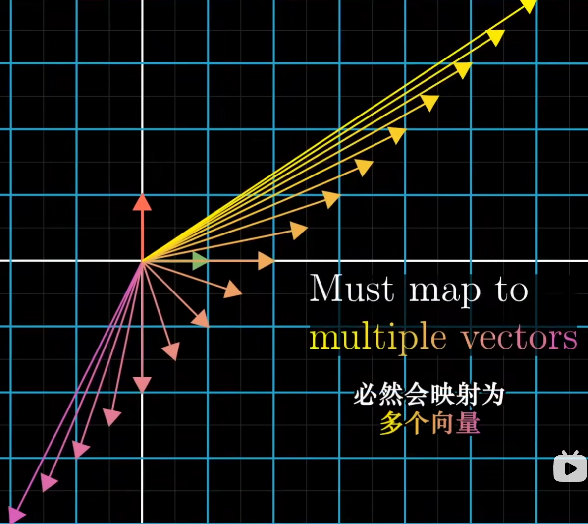

## 矩阵向量的乘法
看到一个比较直观的理解线性变换的方法

可以把前面一个矩阵当作两个列向量也就是基向量，后面一个向量当作系数 
$\left.\left[\begin{array}{cc}a&b\\\\c&d\end{array}\right.\right]\left[\begin{array}{c}x\\y\end{array}\right]=x{\left[\begin{array}{c}a\\c\end{array}\right]}+y{\left[\begin{array}{c}b\\d\end{array}\right]}={\left[\begin{array}{c}ax+by\\cx+dy\end{array}\right]}$
可以把前面的一个矩阵理解成 $[ \;\vec{i}  \quad \vec{j}\; ]$ 

再多一个矩阵来看，就是对基向量多了一次线性变换（**不过要从右往左运算**）

> 经过旋转矩阵  $\vec{i}\quad and \quad\vec{j}$  分别变成了 $\left.\left[\begin{array}{cc}0\\-1\end{array}\right.\right]$ 和 $\left.\left[\begin{array}{cc}-1\\0\end{array}\right.\right]$，然后再分别对这两个基向量左乘剪切矩阵，同理就可以得到上述复合矩阵的两个列向量。

把视野扩大到三维空间，就可以得到：
$$\left.\left[\begin{array}{ccc}0&1&2\\3&4&5\\6&7&8\end{array}\right.\right]\left[\begin{array}{c}x\\y\\z\end{array}\right]=x\left[\begin{array}{c}0\\3\\6\end{array}\right]+y\left[\begin{array}{c}1\\4\\7\end{array}\right]+z\left[\begin{array}{c}2\\5\\8\end{array}\right]$$
左边的是线性变换矩阵，$[x \quad y\quad z]^T$ 是输入向量，得到的结果就是输出向量。

## 矩阵乘法的规律
从上面的应用可以形象地想象出，矩阵相乘是满足结合律的:
因为从右往左看，基向量 $\left.\left[\begin{array}{cc}1\\0\end{array}\right.\right]$ 和 $\left.\left[\begin{array}{cc}0\\1\end{array}\right.\right]$ 经历的变换的顺序仍然是不变的。
$$
(AB)C = A(BC)
$$
而对于矩阵的运算，交换律是不适用的。
$$
M_1M_2\neq M_2M_1
$$
可以用图像来理解这一过程：

## 逆矩阵
### 引入 ：线性方程组的计算
$$\begin{matrix}2x+5y+3z=-3\\4x+0y+8z=0\\1x+3y+0z=2\end{matrix}\longrightarrow\left[\begin{array}{ccc}2&5&3\\4&0&8\\1&3&0\end{array}\right]\left[\begin{array}{c}x\\y\\z\end{array}\right]=\left[\begin{array}{c}-3\\0\\2\end{array}\right]$$
$A\vec{x}=\vec{v}$
要求解对应的 $\vec{x}$ 就要知道 $A^{-1}\;\vec{v}$ 的值。
计算方法分为：行列式为 0  和行列式不为 0
### $det (A) \neq 0$
此时在二维或三维空间中并没有被压缩为面积或体积为 0 的区域。
可以找到唯一的解向量 $\vec{x}$，使它经过线性变换后与 $\vec{v}$ 重合 (**存在唯一解**)

找逆矩阵的过程就是让基向量不发生任何变化，即 $A^{-1}A=does \; nothing$
### $det (A) = 0$
当矩阵空间可以被压缩到更低维度时，它的行列式为 0，那么不存在一个逆矩阵可以使它提升到更高的维度。（例如从一根直线变换到一个平面）

此时解存在 0 个或无数个。

#### 秩（rank）
秩的定义是变换后空间的维数
> Rank is the number of dimensions in the output
#### 零空间（Null space）
一些向量变换后落到零向量上，这些向量构成的空间就是零空间。

