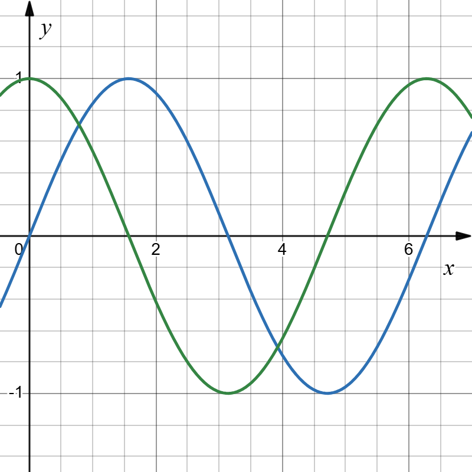
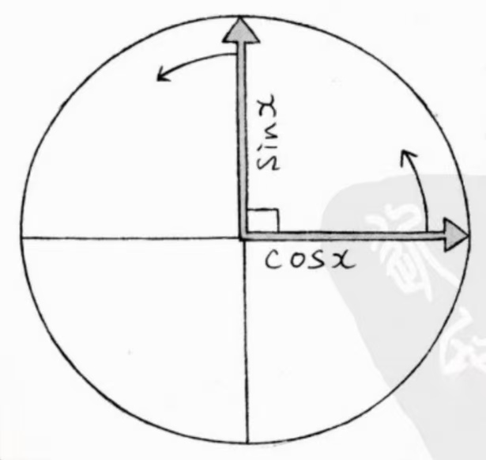
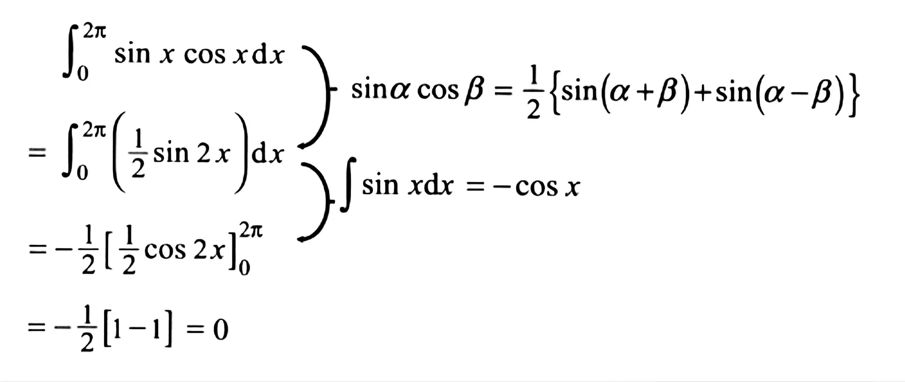
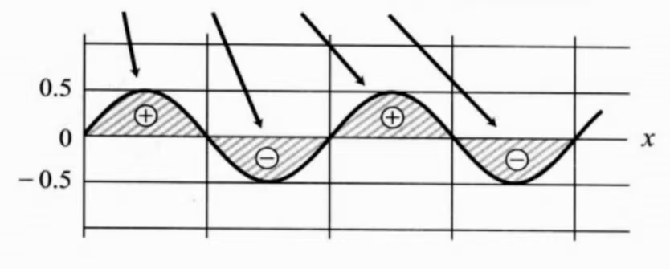
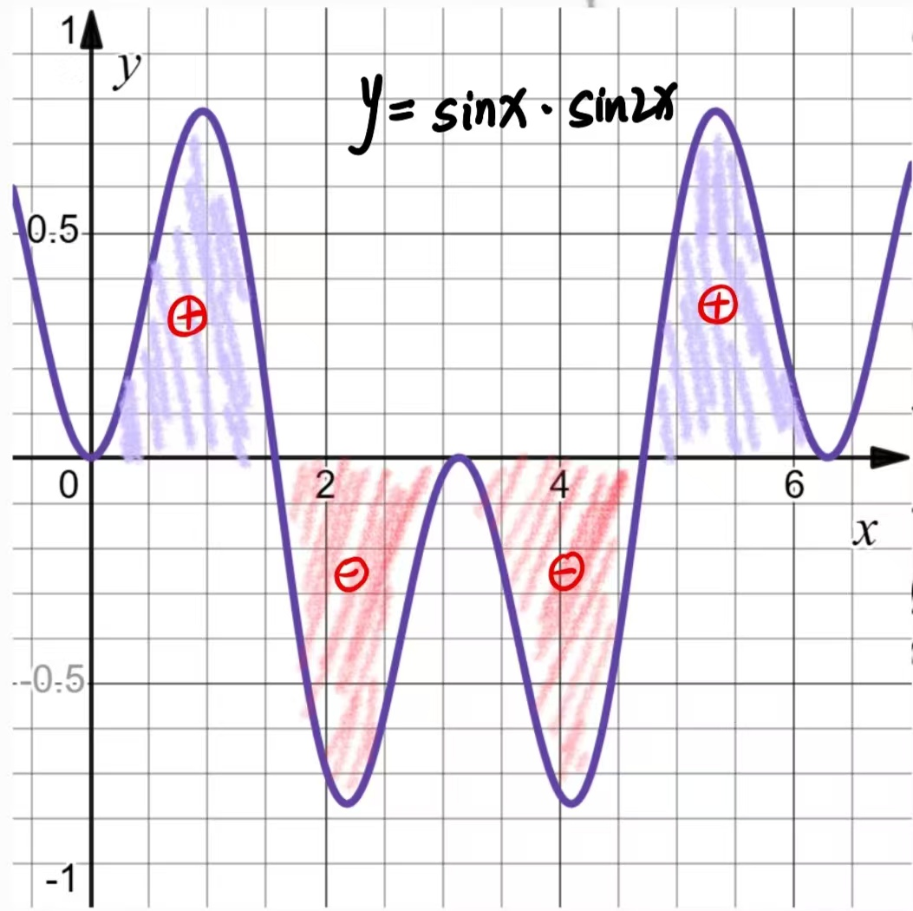

这是求解傅里叶系数的一个重要概念。
首先正弦和余弦函数就是两个相互正交的函数。

这里“正交”成直角的意思，但并不是图像的几何关系，而是 sinx 与 cosx 的波形相差 $\frac{\pi}{2}$，$\frac{\pi}{2}$ 在单位圆中正好对应的就是 90°的角度位置。

>结论：如果函数成正交关系，那么它们的积的定积分为 0。

例 1：
$$y=sinx \times cosx$$
可以根据积化和差公式：
>[!tip] 积化和差公式
>$$\sin\alpha \cos\beta = \frac{1}{2}[\sin(\alpha+\beta) + \sin(\alpha-\beta)]$$

>积分区间取周期长的那个函数的一个周期。

可视化展示：

例 2：
$$
y=sinx\times sin2x
$$
>[!tip] 积化和差公式
>$$
\sin\alpha \sin\beta = -\frac{1}{2}[\cos(\alpha+\beta) - \cos(\alpha-\beta)]
$$

计算过程：
$$
\int_0^{2\pi} \sin x \cdot \sin 2x \, dx = \frac{1}{2} \int_0^{2\pi} \left( \cos x - \cos 3x \right) dx
$$
$$
=\frac{1}{2} \left( \int_0^{2\pi} \cos x \, dx - \int_0^{2\pi} \cos 3x \, dx \right)=0
$$
可视化展示：

由此得出，不同周期的正弦函数的相互成正交关系。
表示为数学语言为：
>[!tip] 数学语言
“m, n 为不同的正数时，$sinnx$ 与 $sinmx$ 成**正交关系**。”
同样的，对于余弦函数也一样，$cosnx$ 与 $cosmx$ 成**正交关系**。
当 $m=n$ 时，$sin^2nx$ ，$cos^2nx$ 始终为正数，所以定积分结果不可能为 0，因此可以推导出, **函数与函数本身不正交**。

