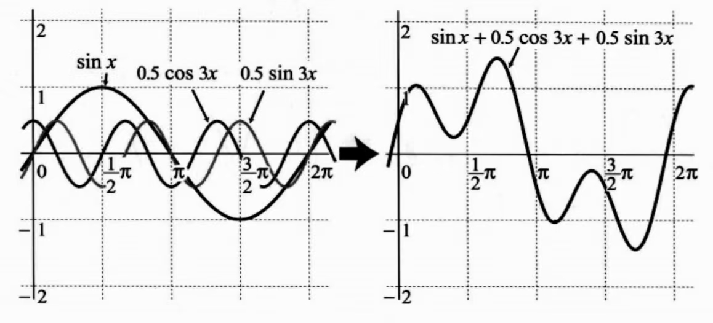
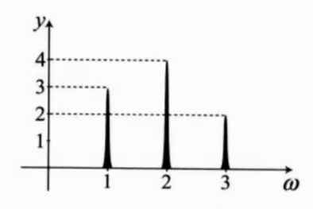

# 正交三角函数的合成（周期相同）
周期相同的正交三角函数进行组合，最简单的是：
$$
asinx+bcosx=sin(x+\theta)
$$
通过 a, b 的组合，周期不变，但可以合成出各种振幅和相位。

# 正交三角函数的合成（周期不同）
通过对 sin 和 cos 的组合，可以得到许多不同形状的波形。
因此可以通过三角函数的合成表示某个函数的表达式，这与后面要讲的**傅里叶级数**有关系。
$$
sinx+sin2x+sin3x
$$

$$
sinx+0.5cos3x+0.5sin3x
$$

# 时间函数到频率谱
像这种随时间变化的函数叫做时间函数

以频率为横坐标，幅值为纵坐标，把它们组合的函数转化为频率谱如下。

傅里叶变换就是从这种加法合成的函数中，将各个函数的周期和大小计算出来。
