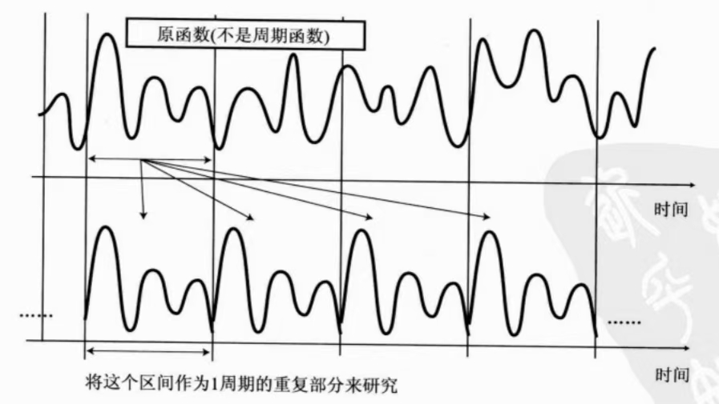

# 介绍
$$
f(x) = \frac{a_0}{2} 
       + a_1 \cos(x) 
       + a_2 \cos(2x) 
       + a_3 \cos(3x)
       + \cdots+a_ncos(nx)
$$
$$
+ b_1 \sin(x)  + b_2 \sin(2x) + b_3 \sin(3x) +\cdots+b_nsin(nx)
$$
$$
=\frac{a_0}{2} + \sum_{n=1}^{\infty} \left[ a_n \cos(nx) + b_n \sin(nx) \right]
$$
这就是傅里叶级数的展开式，看起来很复杂，接下来让我们来分析这些系数代表着什么以及如何计算。
首先根据上一章节的知识可知，这个式子可以通过不同的 $a_n$ 和 $b_n$ 组合出一个复杂的函数表达式。 [2-傅里叶变换(准备知识)](2-傅里叶变换(准备知识).md)

而 $\frac{a_0}{2}$ 则相当于一个常数项，它能将合成后的波形进行上下移动。

# 傅里叶级数与傅里叶变换的关系
通过傅里叶级数得到的函数是周期函数，（这是将多个函数合成的过程）
而通过傅里叶变换计算得到的函数也应该是周期函数。（也就是研究某个东西是怎么组合而成的）

自然现象中很多的波不一定是周期函数，只需要取出其中一段时间区间，将这段区间不断重复出现周期现象，就能采用傅里叶变换进行计算了。

**傅里叶解析**：根据傅里叶级数的逆向思考方法，采用傅里叶变换对波形进行分析。