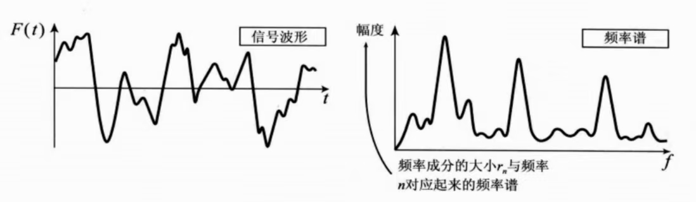

根据上一节 [3-傅里叶级数](3-傅里叶级数.md) 知道，傅里叶解析是求解原波形（函数）由哪些频率的波以怎样的大小组合而成的方法。（反求频率成分及其幅值）

# 类比滤波器
如果想要求解出原波形的频率成分，需要从最低的频率开始，到计算中可能出现的最高的频率，需要对所有频率一一进行分析。

从原波形 $F (x)$ 中求解出傅里叶系数中的 $a_0,a_n,b_n$ 的过程叫做“求解傅里叶系数”，这个过程就像使用滤波器的过程，将不同的频率成分逐一筛选出来。

# 抽取频率成分 
根据之前接触到的函数正交的知识，[1-函数的正交(准备知识)](1-函数的正交(准备知识).md)
$sin(nx),cos(nx)$ 都与自身不成正交关系，因此想要得到哪一部分频率成分的系数，可以将 $F (x)$ 全体乘以该频率成分的三角函数, 然后做定积分即可。
例如：如果想要得到 $a_ncos(nx)$ 对应的系数，只需要将 $F(x)$ 全体乘以 $cosnx$, 然后做定积分，其余频率项都与 $cos(nx)$ 正交，因此只剩下一项：
$$
\int_0^{2\pi}a_ncos(nx)\cdot cos(nx)
$$
根据积化和差公式：
>[!tip] 积化和差公式
>$$
\cos \alpha \cos \beta = \frac{1}{2} [\cos(\alpha + \beta) + \cos(\alpha - \beta)]
$$

$$
\int_{0}^{2\pi} \cos(nx) \cos(nx)  dx = \int_{0}^{2\pi} \frac{1}{2} [\cos(2nx) + 1]  dx=\frac{1}{2}(0+2\pi)=\pi
$$
因此可以得出系数 $a_n$ 的表达式：
$$
a_n=\frac{1}{\pi}\int_0^{2\pi}F(x)cos(nx)dx
$$
同理，系数 $b_n$ 的表达式为：
$$
b_n=\frac{1}{\pi}\int_0^{2\pi}F(x)sin(nx)dx
$$
# 常数项的含义与求取
对于一个周期函数，可以表示为 sin 与 cos 的组合，而对于 sin 和 cos 函数，在整个周期内它们的图形围成的面积都是 0，那么如果对于一个复杂的波形在周期内求定积分，得到的结果不为 0，则可以用一个常数项来表示，面积为 $a_0\cdot 2\pi$。

因此这个常数项为：
$$
a_0=\frac{1}{2\pi}\int_0^{2\pi}F(x)dx
$$
但是，为了统一公式，希望 $a_0$ 的求解过程可以与 $a_n$ 的求解保持一致，
$$
a_n=\frac{1}{\pi}\int_0^{2\pi}F(x)cos(nx)dx
$$
所以当 $n=0$ 时， 
$$
a_0=\frac{1}{\pi}\int_0^{2\pi}F(x)cos(0)dx
$$
因此在傅里叶级数中，常数项应该表示为 $\frac{a_0}{2}$, 这样才能保证常数项的值正确。

>总结：
 >$$
a_n=\frac{1}{\pi}\int_0^{2\pi}F(x)cos(nx)dx
$$
>$$
b_n=\frac{1}{\pi}\int_0^{2\pi}F(x)sin(nx)dx\\
$$
>$$
a_0=\frac{1}{\pi}\int_0^{2\pi}F(x)cos(0)dx
$$

# 频率成分大小
如果要表示成频率谱，则需要求解各个频率成分的大小
计算出 $r_n$:
$$
r_n=\sqrt{a_n^2+b_n^2}
$$
得到频率成分的大小以后，按照 $n$ 从小到大的顺序排列，画出图形，即可得到频率谱了。

