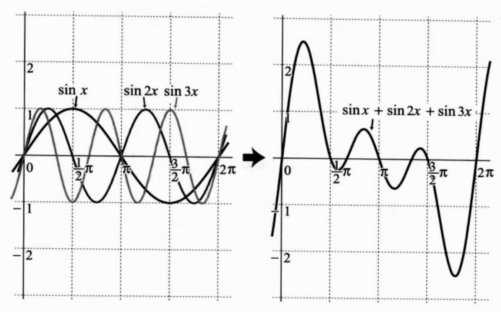
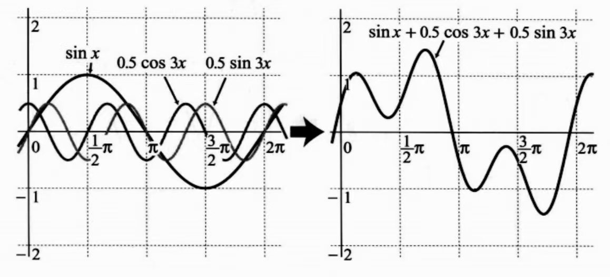
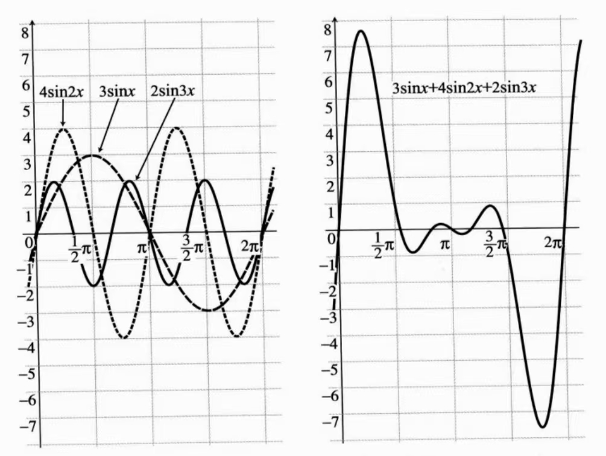
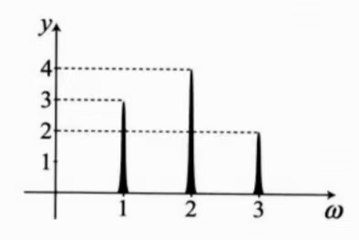
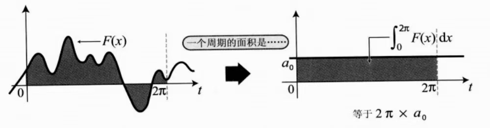
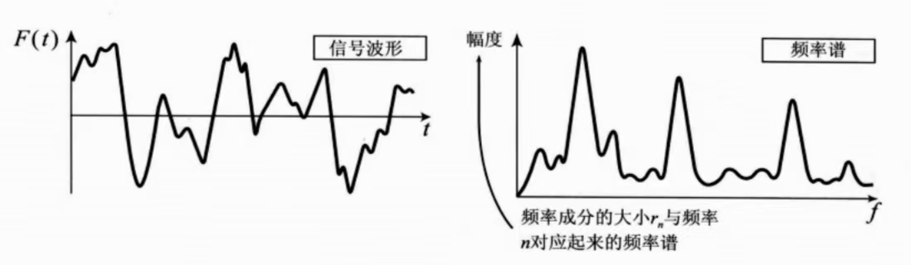

学完傅里叶级数后，有一种感受：看完公式后努力地记下来，记下来之后，一段时间不用，又忘记了😣，常数项表达式分母是什么？到底是哪个系数有 $\frac{1}{2}$？$a_n$ 和 $b_n$ 的表达式总是搞混。
看完这篇文章，你将明白傅里叶系数，原来是这么来的!  帮助你更深刻地理解傅里叶解析的全过程。

---
# 1.开篇介绍
开篇介绍傅里叶级数的展开式：
$$
\begin{equation}
\begin{aligned}
f(x) &= \frac{a_0}{2} 
       + a_1 \cos(x) 
       + a_2 \cos(2x) 
       + \cdots+a_ncos(nx)\\
       &+ b_1 \sin(x)  + b_2 \sin(2x)  +\cdots+b_nsin(nx)\\
       &=\frac{a_0}{2} + \sum_{n=1}^{\infty} \left[ a_n \cos(nx) + b_n \sin(nx) \right]
       
\end{aligned}
\end{equation}
$$

这个式子看起来很复杂，接下来让我们分析这些系数都代表什么，以及它们的计算方法。

# 2.为什么要有傅里叶级数？
傅里叶级数可以用来表示周期函数。
通过对 sin 和 cos 的组合，可以得到许多不同形状的波形，可以看看下面的两种组合：
$$
sinx+sin2x+sin3x
$$

$$
sinx+0.5cos3x+0.5sin3x
$$

sin 和 cos 都是周期函数，通过不同的系数线性组合，得出的函数依然周期函数。
因此，自然现象中的波形如果是非周期函数，可以只截取其中一段，然后重复拓展到整个区间，仍然是周期函数，也可以用傅里叶级数来表示。
![[4d0b6d3f0ef59956a68e0080d8b146c1.jpg]]

图非周期函数周期化（参考《漫画傅里叶解析》）

这就是傅里叶级数的特点：**将多个周期函数合成为一个复杂的波形。**
# 3.傅里叶变换与傅里叶级数有什么关系？
对于这样一种复杂的函数，在时间域中看起来很复杂，如果只看波形，甚至不知道原来是由哪些频率成分组成的，但是如果想要在频率域中表示，成分就很清晰了。

如果以频率为横坐标，频率成分的幅值为纵坐标，把它们组合的函数转化为频率谱图像如下，可以明确的的看出来这个波形由哪些频率成分组成，它们分别的幅值是多少。

求解频率成分的这个过程就是傅里叶变换。

因此傅里叶变换的特点是：**从一个复杂的周期函数分解出各个函数的周期和大小。**

傅里叶级数和傅里叶变换之间的关系，简单来说，就是**合成与分解**的关系。

**傅里叶解析**，就是根据傅里叶级数的逆向思考方法，采用傅里叶变换对波形进行分析。
# 4.傅里叶解析求解频率成分
## 4.1把定积分类比成滤波器？
傅里叶解析是求解原波形（函数）由哪些频率的波以怎样的大小组合而成的方法。其中需要涉及到定积分的使用，定积分就类似于使用**滤波器**，把相应频率的周期函数筛选出来。

因此，如果想要求解出原波形的频率成分，需要从最低的频率开始，到计算中可能出现的最高的频率，需要对所有频率一一进行分析。

这种从从原波形 $F (x)$ 中求解出傅里叶级数中的 $a_0,a_n,b_n$ 的过程叫做“**求解傅里叶系数**”。
## 4.2 抽取频率成分系数$a_n,b_n$
根据之前发过的一篇文章，了解到函数正交是傅里叶解析的一个重要概念，参考上一篇文章：函数正交 [1-函数的正交](1-函数的正交.md)

$sin(nx),cos(nx)$ 都与自身不成正交关系，因此想要得到哪一部分频率成分的系数，可以将 $F (x)$ 全体乘以该频率成分的三角函数, 然后做定积分即可。

---
例如：如果想要得到 $a_ncos(nx)$ 对应的系数，只需要将 $F(x)$ 全体乘以 $cosnx$, 然后做定积分，其余频率项都与 $cos(nx)$ 正交，因此只剩下一项：
$$
\begin{equation}
\int_0^{2\pi}a_ncos(nx)\cdot cos(nx)
\end{equation}
$$
根据积化和差公式：
$$
\begin{equation}
\cos \alpha \cos \beta = \frac{1}{2} [\cos(\alpha + \beta) + \cos(\alpha - \beta)]
\end{equation}
$$
可以得到：
$$
\begin{equation}
\begin{aligned}
\int_{0}^{2\pi} \cos(nx) \cos(nx)  dx &= \int_{0}^{2\pi} \frac{1}{2} [\cos(2nx) + 1]  dx\\&=\frac{1}{2}(0+2\pi)=\pi
\end{aligned}\end{equation}
$$
因此可以得出系数 $a_n$ 的表达式：
$$
\begin{equation}
a_n=\frac{1}{\pi}\int_0^{2\pi}F(x)cos(nx)dx
\end{equation}
$$
同理，系数 $b_n$ 的表达式为：
$$
b_n=\frac{1}{\pi}\int_0^{2\pi}F(x)sin(nx)dx
$$

---
## 4.3 常数项的含义及其求解
对于一个周期函数或者周期延拓的非周期函数，可以表示为$sin$和$cos$的组合。而这些三角函数，在整个周期内它们的图形围成的面积都应该是0。

如果对于一个复杂的波形在周期内求定积分，得到的结果不为0，这个结果可以用一个常数项在表示，面积为 $a_0\cdot 2\pi$。

因此这个常数项为：
$$
\begin{equation}
a_0=\frac{1}{2\pi}\int_0^{2\pi}F(x)dx
\end{equation}
$$
但是，为了统一公式，希望 $a_0$ 的求解过程可以与 $a_n$ 的求解保持一致，
$$
\begin{equation}
a_n=\frac{1}{\pi}\int_0^{2\pi}F(x)cos(nx)dx
\end{equation}
$$
所以当 $n=0$ 时， 
$$
\begin{equation}
a_0=\frac{1}{\pi}\int_0^{2\pi}F(x)cos(0)dx
\end{equation}
$$
因此在傅里叶级数中，常数项应该表示为 $\frac{a_0}{2}$, 这样才能保证常数项的值正确。

因此，通过这样的可视化理解，我们就能对傅里叶系数的求解公式有更深的认识了，最后再总结一下：
>**傅里叶系数求解公式总结：**
>$$\begin{equation}
\begin{aligned}
a_n&=\frac{1}{\pi}\int_0^{2\pi}F(x)cos(nx)dx\\
b_n&=\frac{1}{\pi}\int_0^{2\pi}F(x)sin(nx)dx\\
a_0&=\frac{1}{\pi}\int_0^{2\pi}F(x)cos(0)dx
\end{aligned}
\end{equation}
$$
# 5.利用系数表示出频率谱
如果要表示成频率谱，则需要求解各个频率成分的大小，就是它们的幅值，
计算出 $r_n$:
$$
\begin{equation}
r_n=\sqrt{a_n^2+b_n^2}
\end{equation}
$$
得到频率成分的大小以后，按照 $n$ 从小到大的顺序排列，画出图形，即可得到频率谱了。

谢谢您看到了这里！希望共同进步。
公众号内容如下，欢迎关注！
https://mp.weixin.qq.com/s/C1lxM2xqd1xPASaWsdm2ZQ
