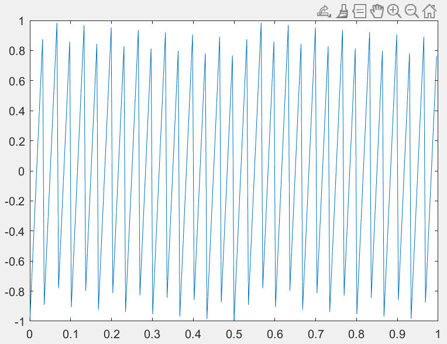
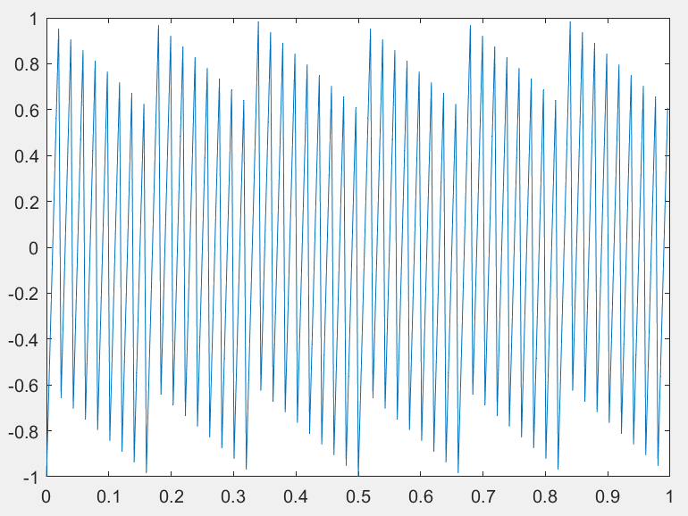
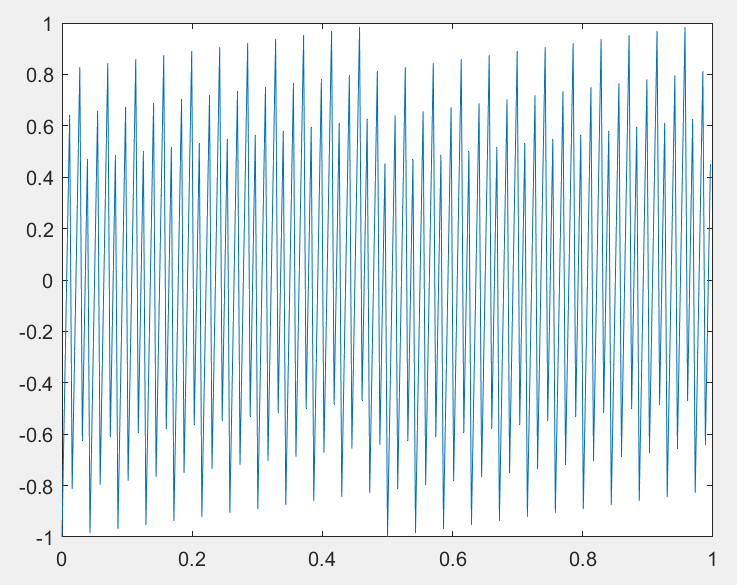

[[2_1采样定理]]
## 常用信号
>[!note +] 函数
> `sawtooth` 三角波 
> `square` 方波
>  `sinc` $函数sin(\pi t)/\pi t$
sinc 函数之所以重要，是因为其 Fourier 变换正好是幅值为 1 的矩形脉冲。

### 锯齿波
```octave
function [ output_args ] = example2_1( input_args )
clc;
clear;
fs=256;%采样频率
f1=50;
t=0:1/fs:1-1/fs;
y=sawtooth(2*pi*f1.*t);%乘以2pi表示出每秒变化的弧度数
plot(t,y);
xlabel('时间t/s');
ylabel('幅值');
end
```
下面的图分别为 f 1=30、50、70




### 方波信号
```octave
function [ output_args ] = example2_2( input_args )
clc;
clear;
fs=2048;%采样频率
f1=20;
t=0:1/fs:1-1/fs;

y=square(2*pi*f1.*t,0.5);
plot(t,y);
xlabel('时间t/s');
ylabel('幅值');
end
```

改变频率 w=50

改变占空比为 80，频率仍为 30

### sinc 函数
```octave
function [ output_args ] = example2_3( input_args )
clc;
clear;
t = linspace(-5,15);%这里默认是100
y = sinc(t);
plot(t,y);
xlabel('时间t/s');
ylabel('幅值');
end
```

在这段程序里面，创建时间轴的过程中，`t = linspace(-5,15)` 是默认在这一段区间分为 100 份，这个和 `t= -5:0.2:15` 类似，但有不同，前者是指定间隔数、后者是指定步长。
当我们将间隔数改为 50 时，可以发现下面的图就没有上面的图平滑。

### chirp 线性调频函数
```octave
function [ output_args ] = example2_4( input_args )
clc;
clear;
fs=1500;%采样频率
f0=0;
f1=100;
t=0:1/fs:1-1/fs;
y=chirp(t,f0,1,f1);
plot(t,y);
xlabel('时间t/s');
ylabel('幅值');

end
```
发现后面的频率太高，绘制的时域图出现失真。


```octave
function example2_4()
clc;
clear;
% 参数设置
fs = 1000;       % 采样频率
f0 = 0;          % 起始频率
f1 = 100;        % 终止频率
t = 0:1/fs:1-1/fs; % 时间向量
y = chirp(t, f0, 1, f1); % 生成线性调频信号

% 绘图
figure;
% 绘制时域信号
subplot(2, 1, 1); % 上图
plot(t, y);
xlabel('时间 t (s)');
ylabel('幅值');
title('线性调频信号');

% 绘制频谱图
subplot(2, 1, 2); % 下图
[~, f, ti, ps] = spectrogram(y, hamming(128), 120, 128, fs); % 计算短时傅里叶变换
surf(ti, f, 10*log10(ps), 'EdgeColor', 'none'); % 绘制时频图
axis tight;
view(2);
xlabel('时间 t (s)');
ylabel('频率 (Hz)');
title('线性调频信号的频谱图');
colorbar;
end
```
>[!tip]- 频谱图的代码解释
>使用短时傅里叶变换 (STFT) 分析信号[Ai(GPT-4o.)-短时傅里叶变换](../../📄知识库/Ai问答库/Ai(GPT-4o.)-短时傅里叶变换.md)
> **代码片段**：
> matlab
> `[~, f, ti, ps] = spectrogram(y, hamming(128), 120, 128, fs);`
> 
> - **步骤和参数说明**：
>     
>     1. **分帧**：信号被分割成长度为 128 的帧，确保在每一帧内信号近似平稳。
>     2. **窗口函数**：
>         - 使用 Hamming 窗减少频谱泄漏。
>     3. **帧移**：帧间有 120 个采样点重叠，相邻帧之间存在 8 个采样点的间隔（128-120）。
>     4. **傅里叶变换**：对每一帧信号执行[快速傅里叶变换](../../📄知识库/Ai问答库/Ai(通义)-快速傅里叶变换.md) (FFT)，得到该帧的频谱。
>     5. **功率谱计算**：
>         - `ps` 是功率谱密度，表示信号在不同时间和频率下的强度分布。
> - **输出变量**：
>     
>     - `f`：频率向量。
>     - `ti`：时间向量（表示每一帧的中心时间点）。
>     - `ps`：功率谱密度矩阵，行表示频率，列表示时间。

^e8d0ce

默认是线性调频


当频率调制的方法改为 quadratic 时，频率变化是二次的。

### pulstran 重复冲击串
```octave
function [ output_args ] = example2_5( input_args )
%EXAMPLE2_5 Summary of this function goes here
%   Detailed explanation goes here
clc;
clear;
% 定义时间向量 t，从0到10毫秒（10e-3秒），以20微秒（1/50e3秒）为步长
t = 0 : 1/50e3 : 10e-3;
% 创建延迟矩阵 d，其中第一列是脉冲出现的时间点，
% 第二列是每个脉冲的幅度衰减因子。这里使用了0.7的指数衰减。
d = [0 : 2/1e3 : 10e-3 ; 0.7.^(0:5)]';
% 使用 pulstran 函数生成一个由高斯脉冲组成的信号 y。
% 参数 @gauspuls 指定了脉冲的形状为高斯型，
% 10e3 是载波频率（10 kHz），0.3 是高斯脉冲的带宽因子。
y = pulstran(t, d, @gauspuls, 10e3, 0.3);
plot(t,y);
xlabel('时间t/s');
ylabel('幅值');
end
```

### 产生方波脉冲（非周期）
```octave
function [ output_args ] = example2_6( input_args )
%EXAMPLE2_6 Summary of this function goes here
%   Detailed explanation goes here
clc;
clear;
fs=1000;%采样频率
t=-1:1/fs:1;
y= rectpuls(t,0.6);
plot(t,y);
xlabel('时间t/s');
ylabel('幅值');
end
```

也可以在指定位置，加上指定脉冲宽度的矩形脉冲
```octave
% 定义时间向量
t = -0.1:0.001:0.4;

% 定义脉冲位置和宽度
pulse_positions = [0, 0.2, 0.35]; % 脉冲开始的时间点
pulse_widths = [0.05, 0.07, 0.04]; % 对应的脉冲宽度

% 初始化信号为零
signal = zeros(size(t));

% 生成多个非周期矩形脉冲
for i = 1:length(pulse_positions)
    signal = signal + rectpuls(t - pulse_positions(i), pulse_widths(i));
end

% 绘制结果
figure;
plot(t, signal);
xlabel('时间 (秒)');
ylabel('幅值');
title('非周期矩形波');
grid on;
```

### 产生三角波脉冲（非周期）
```octave
function [ output_args ] = example2_7( input_args )
%EXAMPLE2_7 Summary of this function goes here
%   Detailed explanation goes here
clc;
clear;
fs=1000;%采样频率
t=-1:1/fs:1;
y= tripuls(t,0.5);
plot(t,y);
xlabel('时间t/s');
ylabel('幅值');
end
```


### 产生 Dirichlet 函数
什么是 [[AI(tongyi)-Dirichlet函数|Dirichlet函数]]
```octave
function [ output_args ] = example2_8( input_args )
clc;
clear;
fs=1000;%采样频率
t=-1:1/fs:1;
% 使用 diric 函数计算 Dirichlet 函数值
% diric(t,N) 计算的是 N 周期的 Dirichlet 函数
% 这里使用了1000作为参数N，意味着函数在区间[-1, 1]内有1000个周期
y = diric(t, 1000);
plot(t,y);
xlabel('时间t/s');
ylabel('幅值');
end

```
